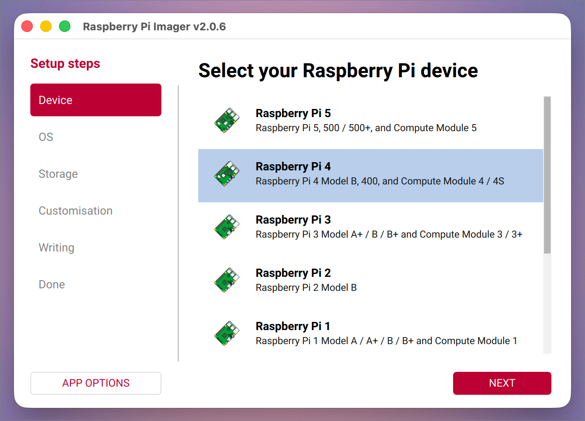
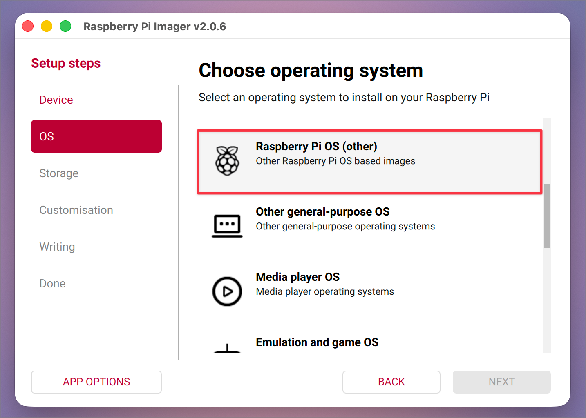
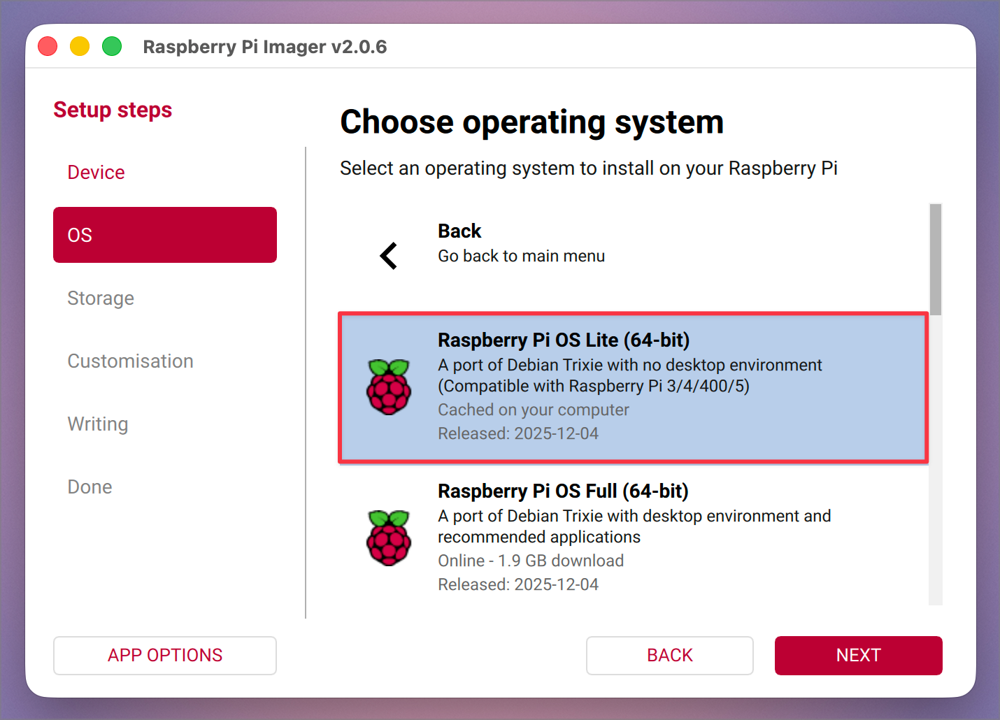
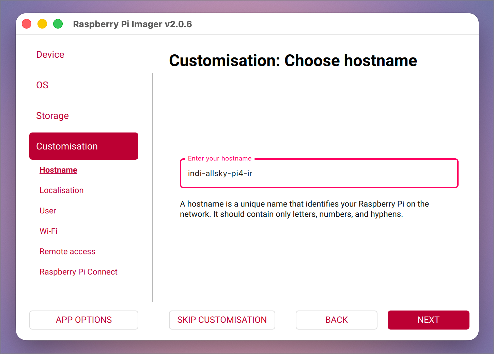
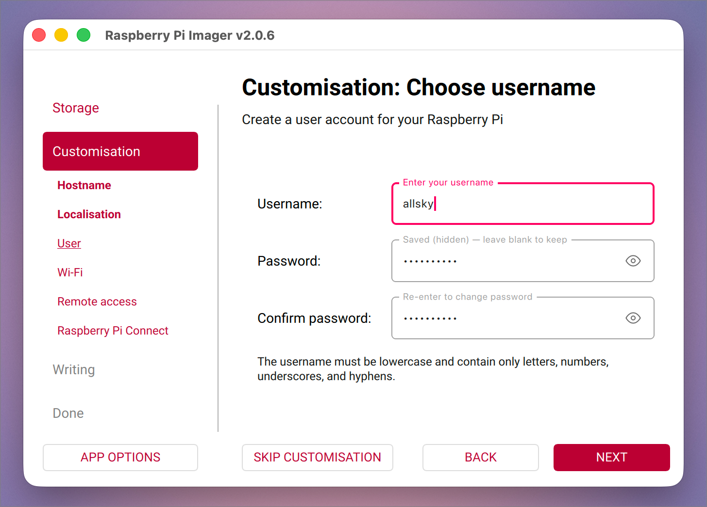
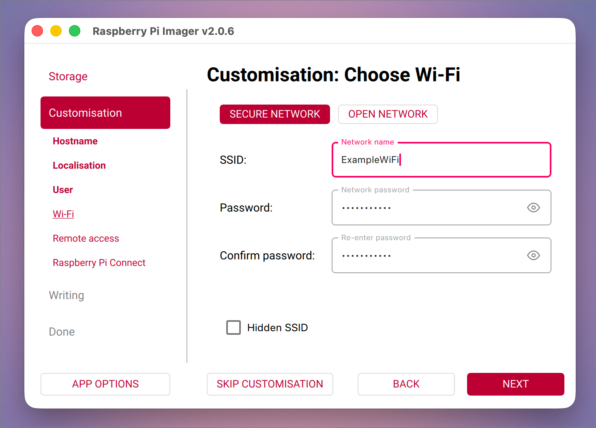

# indi-allsky on Raspberry Pi 4 + Camera Module 3 Wide IR

This guide documents a clean, beginner-friendly setup of **indi-allsky** on a Raspberry Pi 4 using the Raspberry Pi Camera Module 3 Wide IR.

The goal is a reliable all-sky camera setup for:
- sky condition monitoring
- timelapses
- keograms
- star trails

This is written for curious hobbyists *and* technical folks. If something feels confusing at first, that’s normal. We’ll go slowly.

---

## What we’ll cover

- Hardware
- OS + Raspberry Pi Imager settings
- First boot checklist
- Camera verification (libcamera)
- indi-allsky installation
- Web UI + first light
- Keograms & star trails
- Storage & retention
- Troubleshooting
- Roadmap (Pi 5 variant later)

---

## Hardware used

- Raspberry Pi 4 Model B  
- Raspberry Pi Camera Module 3 Wide IR  
- microSD card (Raspberry Pi OS Lite, 64-bit)  
- Stable power supply  
- Outdoor enclosure (optional, later)

> **Note on naming**
>
> Raspberry Pi refers to this camera as the *Camera Module 3 Wide NoIR*
> (meaning it has no infrared filter).
>  
> In this guide, we sometimes shorten this to “IR” to describe its function
> (infrared-sensitive). Both refer to the same camera.

---

## OS + Raspberry Pi Imager settings

We’ll start by flashing Raspberry Pi OS Lite (64-bit) to a microSD card using **Raspberry Pi Imager**.

Even if you’ve done this before, it’s worth slowing down here — a couple of small choices make life much easier later.

> **Note on Raspberry Pi Imager versions**
>  
> Raspberry Pi Imager’s layout changes occasionally between releases.
> This guide uses Raspberry Pi Imager 2.x — if your buttons are in slightly
> different places, that’s okay. The *option names* are what matter.

---

### What you’ll need

- A computer (macOS, Windows, or Linux)
- A microSD card (16 GB minimum, 32 GB recommended)
- A microSD card reader
- Raspberry Pi Imager (free)

Download Raspberry Pi Imager from:  
https://www.raspberrypi.com/software/

---

### Step 1: Select your Raspberry Pi device

When Imager opens, you’ll first be asked which Raspberry Pi you’re using.

Select:

- **Raspberry Pi 4**

This ensures Imager shows OS options that are compatible with the Pi 4.

---

### Step 2: Choose the OS category

Next, select:

- **Raspberry Pi OS (other)**

This is where the Lite (64-bit) images live.

---

### Step 3: Choose Raspberry Pi OS **(Legacy, 64-bit) Lite**

From the list of available OS images, select:

- **Raspberry Pi OS (Legacy, 64-bit) Lite**

> ⚠️ **Important: choose “Legacy” on purpose**
>
> Raspberry Pi Imager may also show a newer **Raspberry Pi OS Lite (64-bit)** option *without* the word “Legacy”.
> That newer option is based on **Debian 13 (Trixie)**.
>
> While Debian 13 is newer, **indi-allsky does not currently provide prebuilt INDI packages for it**.
> Using it requires manually compiling INDI, which adds complexity and time.
>
> To keep this guide beginner-friendly and predictable, we intentionally use  
> **Debian 12 (Bookworm)** via the **Legacy** option.

#### Why Lite + 64-bit?

- No desktop overhead
- Better performance on a headless Pi
- Better Python compatibility
- Fully supported by indi-allsky’s setup scripts

> 💡 **Mental model**
>
> Think of **“Legacy”** here as **“stable and well-supported”**, not “outdated”.

Choosing this option avoids extra build steps and makes the installation much smoother.

---

### Step 4: Choose storage

Select your microSD card.

If you have more than one drive connected, double-check this step. 
Imager will overwrite whatever you select.

---

### Step 5: Customisation settings (important)

Imager will now walk you through several customisation screens.
These settings make a headless setup much easier.

#### Hostname

Set a clear, descriptive hostname:

- Example: `indi-allsky-pi4-ir`

#### Username

Create a non-personal user account:

- Example: `allsky`

#### Wi-Fi

If you plan to use Wi-Fi, enter your network details.

In screenshots, we use a placeholder network name.

> Replace `ExampleWiFi` with the name of your own network.

#### Enable SSH

Enable SSH and choose **password authentication**.

SSH is required to access the Pi remotely without a keyboard or monitor.

You can change all of these settings later — no reflashing required.

You may also see localisation options (time zone and keyboard layout). These are worth setting correctly, but they don’t affect the install process.

---

### Step 6: Write the card

Click **Write** and let Imager do its thing.

This usually takes a few minutes. When it’s done, safely eject the microSD card.

---

## How this guide works

We install and test things one step at a time. When screenshots are helpful, they’ll be called out explicitly 📸

If you’re following along at home:
- you’re not expected to know Linux
- copy/paste is encouraged
- curiosity > perfection

---

## First boot checklist

This section confirms that your Raspberry Pi:

- boots correctly
- is reachable over the network
- is actually 64-bit
- didn’t quietly betray you 😄

We’ll keep this short and calm.  
No camera yet. No indi-allsky yet.

---

### Step 1: Insert the SD card and power on

1. Insert the microSD card into the Raspberry Pi
2. Connect:
   - power
   - Ethernet **or** make sure Wi-Fi is in range
3. Power it on

Give it **30–60 seconds**. Headless boots take a moment.

---

### Step 2: Connect via SSH

From your computer, open a terminal and run:

~~~bash
ssh allsky@indi-allsky-pi4-ir.local
~~~

If `.local` doesn’t work, try connecting via the Pi’s IP address instead (check your router or use `arp -a`).

> **If your first SSH attempt times out**
>  
> That’s okay. On first boot, the Raspberry Pi may still be finishing setup.  
> Wait a moment and try again.

The first time you connect, you may see a message like this:

~~~
The authenticity of host 'indi-allsky-pi4-ir.local' can't be established.
Are you sure you want to continue connecting?
~~~

Type:

~~~
yes
~~~

Then enter the password you set in Raspberry Pi Imager.

If you land at a prompt like:

~~~
allsky@indi-allsky-pi4-ir:~ $
~~~

You’re in. 🎉

---

### Step 3: Confirm the OS is 64-bit

Run:

~~~bash
uname -m
~~~

You should see:

~~~
aarch64
~~~

---

### Step 4: Update the system

~~~bash
sudo apt update
sudo apt full-upgrade -y
~~~

Reboot when finished:

~~~bash
sudo reboot
~~~

Reconnect via SSH after about a minute.

---

### Step 5: Pause and celebrate

At this point:

- the Pi boots successfully
- SSH access works
- the OS is confirmed 64-bit
- naming is consistent with this guide

---

## Camera verification (rpicam / libcamera)

Before installing indi-allsky, we want to confirm that:

- the camera is physically detected
- the camera stack is working
- the system can successfully capture an image headlessly

This step is about confidence, not perfection.

> **Command name note (modern Raspberry Pi OS)**
>
> On current Raspberry Pi OS releases, the camera demo tools are named
> `rpicam-*` (for example, `rpicam-hello` and `rpicam-still`).
>
> Older guides may refer to `libcamera-*` commands — they refer to the same
> underlying camera stack.

---

### Step 1: Power down and connect the camera

If your Pi is currently on, shut it down first:

~~~bash
sudo shutdown now
~~~

Wait until the activity light stops blinking.

Now:

1. Disconnect power from the Pi
2. Connect the Raspberry Pi Camera Module 3 Wide IR
   - Make sure the ribbon cable is fully seated
   - On a Pi 4, the blue side of the ribbon should face the Ethernet/USB ports
3. Reconnect power and let the Pi boot

Give it about 30–60 seconds, then reconnect via SSH.

---

### Step 2: Check that the camera is detected

Once logged in over SSH, run:

~~~bash
rpicam-hello --list-cameras
~~~

If the camera is detected, you should see output similar to:

~~~
Available cameras
-----------------
0 : imx708_wide_noir [4608x2592] (...)
~~~

The exact text may differ. The important thing is that **a camera is listed**.

---

### Step 3: Headless test capture (recommended)

On a headless Pi (SSH-only), `rpicam-hello` may report “Preview window unavailable”
because there is no display attached. That’s normal.

Instead, capture a quick test image:

~~~bash
rpicam-still -n -t 1000 -o test.jpg
~~~

Confirm the file was created:

~~~bash
ls -lh test.jpg
~~~

If `test.jpg` exists and has a non-zero size, the camera is working.

By default, `test.jpg` is saved in your home folder (for example: `/home/allsky/`).

---

### Notes about warnings (safe to ignore)

You may see warnings about “static properties” or “unverified defaults”. If the camera is detected and an image is successfully captured, these warnings can safely be ignored.

---

### If the camera is not detected

If `rpicam-hello --list-cameras` shows **no cameras found**:

1. Power down the Pi
2. Reseat the ribbon cable carefully
3. Double-check orientation
4. Boot again and retry the command

If it still isn’t detected, stop here and troubleshoot before continuing.

---

## What we intentionally did *not* do yet

- ❌ Adjust camera tuning
- ❌ Change exposure or gain
- ❌ Configure indi-allsky
- ❌ Leave test images running

All of that comes later.

---

## Next step

If the camera is detected and `test.jpg` is created successfully:

👉 **indi-allsky installation**
